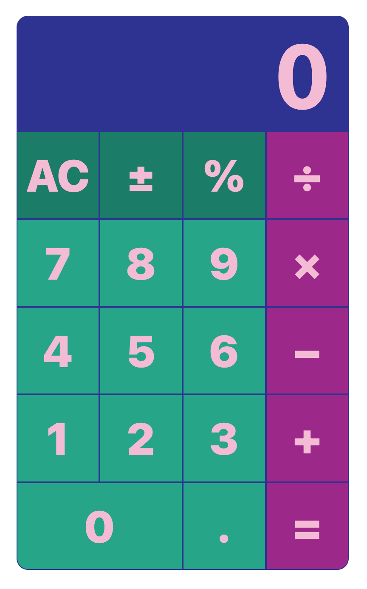

# React.js Calculator

This calculator was written to fulfill the reqirements of the freeCodeCamp [JavaScript Calculator](https://www.freecodecamp.org/learn/front-end-development-libraries/front-end-development-libraries-projects/build-a-javascript-calculator) coding challenge.

The design and interface was inspired by macOS + iOS + [808s and Heartbreak](https://en.wikipedia.org/wiki/808s_%26_Heartbreak#/media/File:808s_&_Heartbreak.png).

The calculator uses Formula/Expression Logic, i.e. it follows the order of operations without requiring parenthesis.

Demo it on [stackblitz](https://react-ts-1cpsnv.stackblitz.io).

